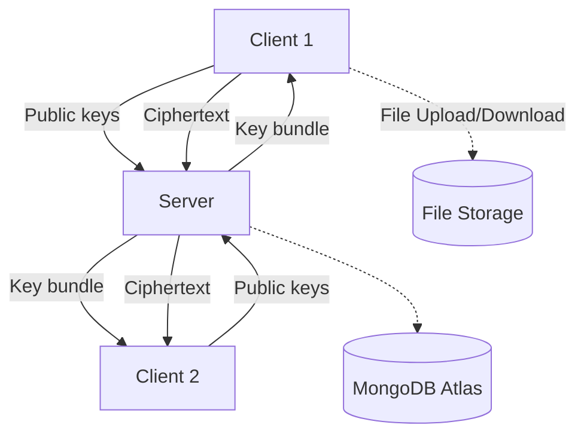

# Chatify: Secure Decentralized Chat (Hybrid Model)

## 📘 Overview
**Chatify** is a secure, real-time chat application that uses a **hybrid end-to-end encryption model**.  
It enables **private and group messaging**, **file & media sharing**, and **rich chat features** like typing indicators and reactions — while ensuring the server never sees plaintext message content.

The server acts as a **key broker and message relay**, not a data reader.

**🎓 Project Type:** Final Year College Project  
**🎯 Deployment:** Development/Demo only (not public production)  
**📅 Timeline:** Academic Year 2025-2026

---

## 🧠 Objectives
- Deliver a **modern, privacy-first chat app** demonstrating advanced cryptographic concepts.  
- Support **E2E-encrypted private and group chats** using **libsignal's X3DH protocol**.  
- Include **media and file sharing**, **cross-device verification**, and **real-time chat features**.  
- Showcase full-stack development skills using Flask, Socket.IO, MongoDB, and production-grade cryptography.  
- Create a complete project suitable for academic demonstration and portfolio presentation.

---

## 🧱 Architecture Summary

### 🧩 Components
| Layer | Technology | Role |
|--------|-------------|------|
| **Frontend** | HTML, Tailwind CSS, Vanilla JS | UI, encryption/decryption, WebSocket communication |
| **Backend** | Flask + Flask-SocketIO | Key distribution, message relay, authentication |
| **Database** | MongoDB Atlas  | Store user public keys, encrypted messages, group metadata |
| **Encryption** | libsignal (X3DH + Double Ratchet) | End-to-end message encryption with forward secrecy |
| **Storage** | Local IndexedDB (frontend) | Stores private keys, decrypted message cache |
| **Media Handling** | Server file storage + AES file encryption | For file and media attachments |

---

## 🔐 Security & Encryption Model (Hybrid)

### Overview
- **Using libsignal library** for industry-standard Signal Protocol implementation.  
- **X3DH (Extended Triple Diffie-Hellman)** for initial key agreement.  
- **Double Ratchet Algorithm** for forward secrecy and post-compromise security.  
- Each user **generates and holds** their own private keys.  
- The server stores **only public keys** and facilitates automatic key exchange.  
- Messages are encrypted client-side and stored on the server as ciphertext.

### Keys
| Key | Owner | Purpose | Shared with |
|------|--------|----------|--------------|
| **Identity Key Pair (IK)** | Client | Permanent identity | Public uploaded to server |
| **Signed Prekey (SPK)** | Client | Medium-term ECDH key (signed by IK) | Public uploaded |
| **One-Time Prekeys (OPKs)** | Client | Used once per new session | Public uploaded |
| **Ephemeral Key (EPK)** | Client | Per-session key | Shared in message metadata |
| **AES Session Key** | Both Clients | Encrypt/decrypt messages | Derived via ECDH locally |

### Encryption Flow (libsignal X3DH)
1. **Registration:** 
   - Client uses libsignal to generate key bundle (IK, SPK, OPKs)
   - Uploads only public keys to server
2. **Key Exchange (Automatic via libsignal):**  
   - Sender requests recipient's prekey bundle from server
   - libsignal performs X3DH protocol automatically
   - Derives shared secret and establishes Double Ratchet session
3. **Encryption:**  
   - libsignal encrypts messages with session keys
   - Each message advances the ratchet (forward secrecy)
4. **Message Storage:** 
   - Server stores libsignal ciphertext + metadata (never plaintext)
5. **Decryption:** 
   - Recipient's libsignal session decrypts automatically
   - Ratchet state advances for next message

### Group Chat Encryption
- Group chat uses a **shared symmetric group key (AES-256)**.  
- The group admin encrypts the group key with each member's public key using libsignal sessions.  
- When membership changes, a new group key is generated and distributed to remaining members.  
- **Important:** Users who leave/get kicked lose access to new messages (old messages stay encrypted with old key).  
- Message history is NOT re-encrypted (performance + complexity reasons).

### Device Sync & Linking
- **QR Code Device Linking:** Establish secure channel between devices for key sync
- **Message History Sync:** New devices can fetch and decrypt message history using synced session keys
- **Session State Sync:** libsignal ratchet state synchronized across user's devices

---

## 🧰 Features

### 🟢 Core (MVP)
| Feature | Description |
|----------|-------------|
| **User registration/login** | Secure authentication using hashed credentials (bcrypt). |
| **Private chat (1-to-1)** | True E2E encrypted messages between two users. |
| **Group chat** | Shared AES group key managed by admin. |
| **Server-wide chat** | Public room (encrypted in transit via TLS only, not E2E). |
| **Typing indicators** | “User is typing…” Socket.IO event. |
| **Online/offline status** | Track user presence via socket connection. |
| **Read receipts** | Show “sent”, “delivered”, “read” ticks. |
| **Message reactions** | Emoji responses per message. |
| **Message edit/delete** | Allow sender to modify or delete messages. |
| **File transfer** | AES-encrypted file upload & download (stored in MongoDB GridFS, max 16MB per file). |
| **Image & video sharing** | Inline previews (encrypted storage). |
| **Voice messages** | Record and send encrypted audio blobs. |
| **File integrity check** | SHA-256 or HMAC verification. |
| **QR-code device linking** | Share device keys via QR for login. |
| **Rich text formatting** | Basic markdown, emoji, bold/italic text. |
| **Stickers & GIFs** | User-selectable, optionally encrypted. |
| **Dark/light mode** | User UI preference toggle. |

---

## 🔒 Security Features
- **libsignal Protocol:** Industry-standard Signal Protocol (X3DH + Double Ratchet)  
- **Forward Secrecy:** Each message uses unique key via ratcheting  
- **Post-Compromise Security:** Even if session key leaks, future messages remain secure  
- **Key Fingerprint Verification:** Users can verify contact identities  
- **Secure Password Storage:** bcrypt hashing for user credentials  
- **TLS Transport:** HTTPS + WSS for all client-server communication  
- **Zero Plaintext Storage:** Server never sees message content  
- **File Integrity:** SHA-256 hash validation for uploaded files  
- **Device Linking:** QR-based secure channel for cross-device key sync  

---

## 🧩 Data Model (MongoDB)

### **Users**
```json
{
  "_id": "uuid",
  "username": "alice",
  "password_hash": "...",
  "identity_pub": "<base64>",
  "signed_prekey_pub": "<base64>",
  "signed_prekey_sig": "<base64>",
  "one_time_prekeys": [
    { "id": "opk123", "key": "<base64>", "used": false }
  ],
  "created_at": "2025-11-01T12:00:00Z"
}
```

### **Messages**
```json
{
  "_id": "uuid",
  "chat_id": "userA_userB",
  "sender": "alice",
  "recipient": "bob",
  "ciphertext": "<base64>",
  "nonce": "<base64>",
  "ephemeral_pub": "<base64>",
  "timestamp": "2025-11-01T12:01:00Z",
  "type": "text/file/media",
  "metadata": {
    "read": false,
    "reactions": [],
    "reply_to": null
  }
}
```

### **Groups**
```json
{
  "_id": "uuid",
  "group_name": "Dev Chat",
  "admin": "alice",
  "members": ["alice", "bob", "carol"],
  "group_key_encrypted": {
    "bob": "<AES-encrypted group key>",
    "carol": "<AES-encrypted group key>"
  },
  "created_at": "2025-11-01T12:05:00Z"
}
```

---

## ⚙️ API Design

### **Authentication**
- `POST /register`
  - Body: username, password, public keys bundle
  - Response: success + token
- `POST /login`
  - Body: username, password
  - Response: JWT/session cookie

### **Key Management**
- `GET /keys/:user_id`
  - Returns user’s public key bundle
- `POST /refresh-prekeys`
  - Uploads new one-time prekeys

### **Messaging**
- `POST /messages`
  - Body: encrypted payload, metadata
  - Server stores ciphertext
- `GET /messages/:chat_id`
  - Returns encrypted message list
- `Socket Event: message`
  - Real-time delivery

### **Groups**
- `POST /group/create`
- `POST /group/invite`
- `POST /group/message`
- `GET /group/:id/messages`

### **File Handling**
- `POST /upload`
  - Multipart form; file encrypted client-side
- `GET /download/:file_id`
  - Returns encrypted file blob

### **Presence & Typing**
- `Socket Event: typing_start / typing_stop`
- `Socket Event: user_online / user_offline`

---

## 🧩 Architecture Diagram (Mermaid)



---

## 🧭 Development Roadmap (Refined)

### **Phase 0: Project Setup & Foundation** ⏱️ Week 1-2 ✅ **COMPLETED**
**Goal:** Establish development environment and basic infrastructure

- [x] Initialize Git repository with proper `.gitignore`
- [x] Setup Flask project structure (blueprints, config)
- [x] Configure MongoDB connection (local or Atlas)
- [x] Setup Socket.IO with Flask-SocketIO
- [x] Create basic HTML/CSS frontend with Tailwind
- [x] Implement Socket.IO connection handling
- [x] Setup environment variables (`.env` file)
- [x] Create requirements.txt with all dependencies
- [x] Implement MongoDB models and utilities
- [x] Basic error handling and logging
- [x] Create comprehensive documentation (README, SETUP, PROJECT_STATUS)
- [x] Setup script for Windows (setup.bat)
- [x] Basic authentication system (registration/login)
- [x] Chat interface UI
- [x] Contact list functionality

**Deliverable:** ✅ Working Flask server + MongoDB + Socket.IO + Authentication + Chat UI

---

### **Phase 1: Authentication & User Management** ⏱️ Week 3-4 ✅ **COMPLETED**
**Goal:** Secure user registration and login system

- [x] Design User schema in MongoDB
- [x] Implement registration endpoint with bcrypt password hashing
- [x] Implement login endpoint with session/JWT authentication
- [x] Create registration UI (form validation)
- [x] Create login UI with remember me option
- [x] Implement logout functionality
- [x] User profile page (basic info display)
- [x] Session management (server-side)
- [x] Password strength validation
- [x] Error handling (duplicate username, wrong password)

**Deliverable:** ✅ Users can register, login, logout securely

**Note:** Authentication was implemented as part of Phase 0 setup

---

### **Phase 2: libsignal Integration & Key Management** ⏱️ Week 5-6 ✅ **COMPLETED**
**Goal:** Implement Signal Protocol for E2E encryption

- [x] Install and configure Web Crypto API (browser-native, no external libs needed)
- [x] Generate cryptographic key bundles on client registration (IK, SPK, OPKs)
- [x] Store public keys in MongoDB (User schema update)
- [x] Store private keys in browser IndexedDB (Dexie.js)
- [x] Create prekey bundle upload API (integrated in registration)
- [x] Create prekey bundle fetch API (`GET /chat/prekey-bundle/:username`)
- [x] Implement X3DH key exchange on client (crypto.js)
- [x] Initialize sessions between users with HKDF key derivation
- [x] Test session establishment (ready for Phase 3 testing)
- [x] Handle one-time prekey rotation (`POST /chat/upload-prekeys`)
- [x] Created comprehensive crypto.js wrapper module
- [x] Created db.js for IndexedDB management
- [x] Fixed Socket.IO broadcast bug

**Deliverable:** ✅ Two users can establish encrypted session with real cryptography

---

### **Phase 3: Private Chat (1-to-1 E2E Encrypted)** ⏱️ Week 7-8 ✅ **COMPLETED**
**Goal:** Core messaging functionality with full E2E encryption

- [x] Design Messages schema in MongoDB (already done in Phase 0)
- [x] Create chat UI (message list, input box) (already done in Phase 0)
- [x] Implement message encryption with crypto.js before sending
- [x] Socket.IO event: `send_message` (encrypted payload) - already implemented
- [x] Server stores encrypted message in MongoDB
- [x] Socket.IO event: `receive_message` (broadcast to recipient) - already implemented
- [x] Client-side decryption with crypto.js
- [x] Display decrypted messages in chat UI
- [x] Message timestamp display
- [x] Sender/receiver message alignment (left/right bubbles)
- [x] Auto-scroll to latest message
- [x] Contact list UI (fetch all users) (already done)
- [x] Chat history loading (fetch and decrypt past messages)
- [x] Handle session initialization when opening new chat (automatic X3DH)
- [x] Error handling for decryption failures (try-catch with user-friendly messages)
- [x] Typing indicators (typing_start/typing_stop events)
- [x] Real-time message delivery via Socket.IO

**Deliverable:** ✅ Two users can send E2E encrypted text messages in real-time

---

### **Phase 4: Real-Time Features** ⏱️ Week 9 ✅ **COMPLETED**
**Goal:** Enhance UX with presence and activity indicators

- [x] Online/offline status tracking (Socket.IO connection events)
- [x] Display online indicator (green dot) in contact list
- [x] Typing indicator (`typing_start`, `typing_stop` events)
- [x] Show "User is typing..." in chat window
- [x] Message delivery status (sent, delivered)
- [x] Read receipts (mark message as read when viewed)
- [x] Display checkmarks (✓ sent, ✓✓ delivered, ✓✓ blue read)
- [x] Unread message counter per chat with badge display
- [x] Message reactions with emoji picker (❤️ 👍 😂 😮 😢 🙏)
- [x] Real-time reaction updates via Socket.IO
- [x] Reaction counts displayed below messages
- [x] Fixed timestamp display (proper UTC formatting)
- [x] Implemented temp ID system for message tracking
- [x] Cleaned up debug logs

**Deliverable:** ✅ Rich real-time chat experience with presence info, read receipts, unread counters, and reactions

**Bugs Fixed:**
- ✅ Read receipts not showing until reply/reaction
- ✅ Unread badge not showing until refresh
- ✅ Read receipts not sent when chat already open
- ✅ Message status updates arriving before confirmation
- ✅ Timestamp showing wrong time (UTC format issue)

---

### **Phase 5: Group Chat** ⏱️ Week 10-11 ✅ **COMPLETED**
**Goal:** Multi-user encrypted group conversations

- [x] Design Groups schema in MongoDB
- [x] Create group creation UI (name, add members)
- [x] Generate group AES-256 key on client (admin)
- [x] Encrypt group key with each member's ECDH public key
- [x] Store encrypted group keys in MongoDB
- [x] Group message encryption (with group AES key)
- [x] Group message UI (similar to private chat)
- [x] Socket.IO events for group messages
- [x] Real-time group message delivery
- [x] Group message decryption and display
- [x] Add/remove members functionality (admin only)
- [x] Key rotation when membership changes
- [x] Group member list display
- [x] Group info page (name, members, admin)
- [x] Leave group functionality
- [x] Old messages stay accessible with old key (no re-encryption)

**Deliverable:** ✅ Users can create groups and send E2E encrypted group messages

**Core Features Completed:**
- ✅ Group creation with encrypted key distribution
- ✅ Group chat UI with tabs (Direct/Groups)
- ✅ AES-256 group key encryption/decryption
- ✅ Group message encryption with shared key
- ✅ Real-time group messaging via Socket.IO
- ✅ Group history loading and decryption
- ✅ Group info modal with member list
- ✅ Add member functionality (admin only, with key encryption)
- ✅ Remove member functionality (admin only, with key rotation)
- ✅ Leave group functionality (admin transfer logic)
- ✅ Old messages remain accessible with original keys

---

### **Phase 6: File & Media Sharing** ⏱️ Week 12-13 ✅ **COMPLETED**
**Goal:** Share files, images, videos securely

- [x] Setup MongoDB GridFS for file storage
- [x] File size limit: 16MB per file (MongoDB document limit)
- [x] File encryption on client before upload (AES-GCM)
- [x] File upload API (`POST /file/upload`) with multipart form
- [x] Store encrypted file + metadata in GridFS
- [x] File download API (`GET /file/download/:file_id`)
- [x] File info API (`GET /file/info/:file_id`)
- [x] File type validation (prevent malicious files)
- [x] SHA-256 hash for file integrity verification
- [x] Client-side file encryption before upload
- [x] Client-side file decryption after download
- [x] File attachment UI (button with file preview)
- [x] File type icons (images, videos, audio, documents)
- [x] File size display in messages
- [x] Download button in file messages
- [x] Image preview in chat (inline display) - Optional enhancement
- [x] Voice message recording (browser MediaRecorder API) - Optional enhancement
- [x] Audio playback in chat - Optional enhancement

**Deliverable:** ✅ Users can share encrypted files in private and group chats

**Features Completed:**
- ✅ GridFS integration with MongoDB
- ✅ File upload/download/info endpoints with encryption support
- ✅ File size and type validation (16MB limit, allowed extensions)
- ✅ SHA-256 integrity verification
- ✅ Authorization checks (sender/recipient validation)
- ✅ Client-side AES-GCM file encryption/decryption
- ✅ File attachment button with preview UI
- ✅ Secure file download with automatic decryption
- ✅ File type icons and metadata display
- ✅ Works in both private and group chats

---

### **Phase 7: Message Enhancements** ⏱️ Week 14 ✅ **COMPLETED**
**Goal:** Rich messaging features

- [x] Message reactions (emoji picker) - Already completed in Phase 4
- [x] Store reactions in message metadata - Already completed in Phase 4
- [x] Display reactions below messages - Already completed in Phase 4
- [x] Message delete (delete for everyone)
- [x] Reply to message (quote original message)
- [x] Rich text formatting (bold, italic, code blocks, strikethrough, links)
- [x] Emoji picker integration - Simple emoji reaction picker already implemented

**Deliverable:** ✅ Feature-rich messaging experience

**Features Completed:**
- ✅ Delete message for everyone (owner only)
- ✅ Reply to message with quote preview
- ✅ Markdown-style text formatting (**bold**, *italic*, `code`, ~~strike~~, [links])
- ✅ Formatting helper tooltip
- ✅ Real-time deletion notifications
- ✅ Reply metadata in messages

---

### **Phase 8: Server-Wide Chat & UI Polish** ⏱️ Week 15 ✅ **COMPLETED**
**Goal:** Public chat room and final UI improvements

- [x] Create global chat room (no E2E, only TLS)
- [x] Public chat UI (accessible to all logged-in users)
- [x] Message broadcast to all connected clients
- [x] Dark mode / Light mode toggle
- [x] Theme persistence (localStorage)
- [x] Responsive design (mobile-friendly)
- [x] Real-time contact updates (new user registration)
- [x] Socket.IO reconnection handling
- [x] Mobile-optimized message bubbles
- [x] Emoji picker with 200+ emojis
- [x] GIF picker integration (GIPHY API)
- [x] Image markdown support in messages

**Deliverable:** ✅ Complete app with public chat and polished UI

**Features Completed:**
- ✅ Server-wide chat with real-time messaging
- ✅ Dark/Light mode toggle with localStorage persistence
- ✅ Fully responsive mobile design (60% message width on mobile)
- ✅ Automatic contact list updates when new users register
- ✅ Socket.IO auto-reconnection with message reload
- ✅ Mobile hamburger menu with slide-in sidebar
- ✅ Optimized padding and spacing for mobile devices
- ✅ Emoji picker with 200+ emojis for quick insertion
- ✅ GIF picker with GIPHY API integration (search & trending)
- ✅ Image/GIF display support in messages with markdown syntax

**Note:** To enable GIF picker, get a free API key from https://developers.giphy.com/ and update `GIPHY_API_KEY` in chat.html

---

### **Phase 9: Testing, Documentation & Demo Prep** ⏱️ Week 16-17 [IN PROGRESS]
**Goal:** Finalize for college presentation

- [x] Write unit tests (pytest for backend)
- [x] Test authentication flows
- [x] Test chat functionality
- [x] Test group operations
- [x] Create test configuration (pytest.ini)
- [x] Create test runner script
- [x] Performance optimization (message loading, file uploads)
- [x] Create comprehensive README.md
- [x] Document API endpoints (docs/API.md)
- [x] Create architecture diagrams (docs/ARCHITECTURE.md)


**Deliverable:** Production-ready demo with full documentation

**Testing & Documentation Completed:**
- ✅ Authentication tests (registration, login, logout, key management)
- ✅ Chat tests (history, user list, reactions, deletion)
- ✅ Group tests (creation, membership, permissions)
- ✅ Test fixtures and configuration
- ✅ Test runner script with coverage support
- ✅ API documentation with all endpoints (docs/API.md)
- ✅ Architecture diagrams and system design (docs/ARCHITECTURE.md)

**Performance Optimizations Completed:**
- ✅ Database indexes (compound indexes for messages, users, server_messages)
- ✅ Message pagination with lazy loading (scroll-to-load-more)
- ✅ File upload progress tracking with XHR
- ✅ Server chat message caching (30-second TTL)

---

## 📊 Estimated Timeline
**Total Duration:** 16-17 weeks (~4 months)  
**Recommended:** 10-15 hours/week  
**Critical Path:** Phases 0-3 (foundation and core messaging)  
**Flexibility:** Phases 7-8 can be adjusted based on time constraints

---

## 🧾 Dependencies

**Backend (Python):**
- Flask (web framework)
- Flask-SocketIO (WebSocket support)
- PyMongo (MongoDB driver)
- python-axolotl / python-axolotl-curve25519 (libsignal for Python)
  - Alternative: Use JavaScript libsignal on frontend + REST API
- bcrypt (password hashing)
- python-dotenv (environment variables)
- Flask-CORS (cross-origin requests)
- PyJWT (JWT authentication - optional)
- Pillow (image processing - optional)

**Frontend (JavaScript):**
- **Web Crypto API** (browser-native cryptography - currently used)
- TailwindCSS (styling)
- Socket.IO client (WebSocket communication)
- Dexie.js (IndexedDB wrapper for storing keys)
- FontAwesome (icons)

**Database:**
- MongoDB (local or Atlas free tier)

**Development Tools:**
- Git & GitHub
- VS Code
- Postman (API testing)
- Chrome DevTools (debugging)  

---


---

## 🎯 Success Criteria (For College Evaluation)

### **Technical Excellence**
- ✅ Fully functional E2E encrypted chat system
- ✅ Industry-standard cryptography (libsignal)
- ✅ Real-time communication with WebSockets
- ✅ Modern full-stack architecture
- ✅ Database design and optimization

### **Feature Completeness**
- ✅ Private and group messaging
- ✅ File/media sharing
- ✅ Rich UX features (typing, reactions, replies, formatting)
- ✅ Polished UI with theme support

### **Documentation & Presentation**
- ✅ Comprehensive technical documentation
- ✅ Clear architecture diagrams
- ✅ Live demo with multiple users
- ✅ Code quality and organization
- ✅ Security analysis and threat model

---

## 🧠 Future Expansion (Post-Submission)
- **Device Linking & Sync** (Multi-device support with QR-based secure linking)
  - Generate QR code on primary device (contains pairing token)
  - QR code scanner on new device
  - Establish secure WebSocket channel between devices (via server relay)
  - Exchange device keys through secure channel
  - Sync session states to new device
  - Sync message history to new device
  - Store device fingerprints in MongoDB
  - Device management UI (list linked devices)
  - Remove/unlink device functionality
- Voice/video calling (WebRTC)
- Multi-language interface  
- Encrypted backup/export  
- AI chatbot integration  
- Desktop client (Electron)  
- Mobile app (React Native)

---

## 📄 Summary
**Chatify** demonstrates a perfect balance between **real-world usability** and **cryptographic privacy**.  
It is designed as a **hybrid decentralized chat** using **industry-standard Signal Protocol**:  

> "The server connects people — not their secrets."

This project showcases:
- ✨ Advanced full-stack development skills
- 🔒 Production-grade security implementation
- 🚀 Real-time system architecture
- 🎓 Research and application of modern cryptography
- 💼 Portfolio-worthy demonstration of technical excellence

**Perfect for a final year computer science/engineering project!**
